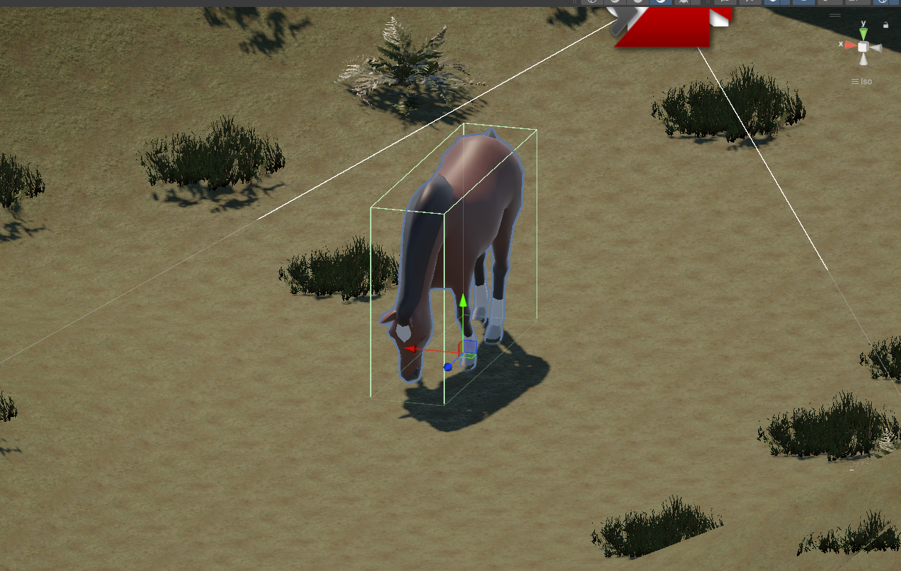
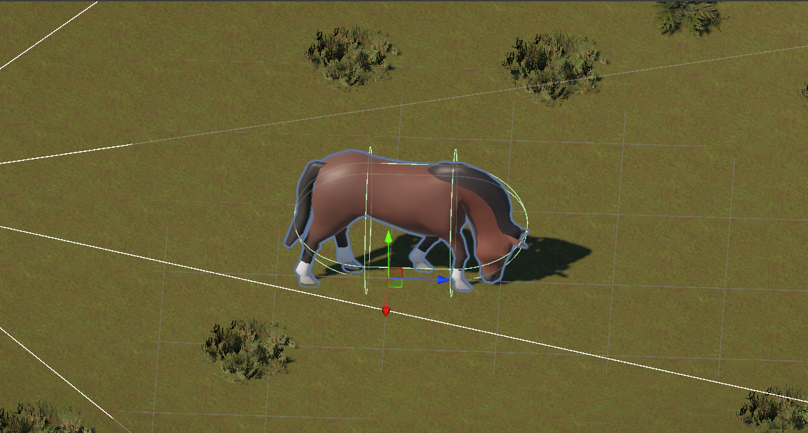
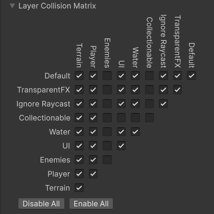
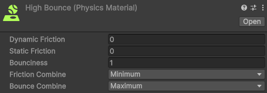
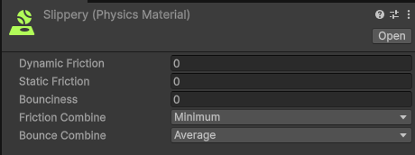
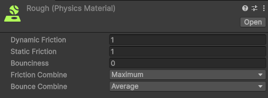

# Práctica 3 Interfaces Inteligentes. Movimiento y Físicas en Unity

- **Author**: Himar Edhey Hernández Alonso
- **Subject**: Interfaces Inteligentes

## Introduction

In this practice, we will explore the implementation of movement and physics in Unity.

## Physics Situation Exercises

### Situation 1

*El plano no es un objeto físico. El cubo es un objeto físico y la esfera no. En este caso, el plano y la esfera sólo tendrán collider, mientras que el cubo debe tener Rigidbody.*
In this case, the plane maintains his position in the scene as well as the sphere, the cube remains on the plane. No movement occurs because the plane is exactly under the cube, but this collision between an dynamic collider (cube) and a static collider (plane) occurs and messages are sent on collision.

### Situation 2

*El plano no es un objeto físico. El cubo es un objeto físico y la esfera también. En este caso, el plano sólo tendrán collider, mientras que el cubo y la esfera deben tener Rigidbody.*
In this situation, the plane maintains his position in the scene, whereas the cube remains on the plane, and the sphere falls colliding with the cube and then rolling on the plane until the end, where it falls off the plane. The first collision, between the cube (dynamic collider) and the sphere (dynamic collider) occurs and messages sent on collision. In the case of the sphere and the plane (static collider), the same happens, the collision is ocurrs and messages are sent on collision. This is the same as between the cube and the plane.

### Situation 3

*El plano no es un objeto físico. El cubo es un objeto físico y la esfera es cinemática. En este caso, el plano sólo tendrán collider, mientras que el cubo y la esfera deben tener Rigidbody esta última cinemático.*
In the situation described, all objects remain in their initial positions. The plane stays static as it is not a physical object, the cube rests on the plane without movement but with the collision described before, and the kinematic sphere remains suspended in the air, unaffected by gravity although have rigidbody. It the sphere (kinematic collider) collides with the cube (dynamic collider), the collision occurs and messages are sent on collision, but if the sphere collides with the plane (static collider), no collision event message is sent.

### Situation 4

*El plano es un objeto físico. El cubo es un objeto físico y la esfera es física. En este caso, todos los objetos deben tener Rigidbody.*
In this case all objects are affected by physics so they all fall due to gravity. There are no collisions between the objects as they fall at the same speed.

### Situation 5

*El plano es un objeto físico. El cubo es un objeto físico y la esfera es física con 10 veces más masa que el cubo. En este caso, todos los objetos deben tener Rigidbody.*
In this situation, occurs the same as in situation 4, the mass difference does not affect the falling speed as gravity is constant for all objects as the second law of Newton states.

### Situation 6

*El plano es un objeto físico. El cubo es un objeto físico y la esfera es física con 100 veces más masa que el cubo. En este caso, todos los objetos deben tener Rigidbody.*
In this situation, occurs the same as in situation 4 and 5, the mass difference does not affect the falling speed as gravity is constant for all objects. So the objects accelerate at the same rate but in terms of force, the sphere will have a greater force due to its higher mass (F = m * a).

### Situation 7

*El plano es un objeto físico. El cubo es un objeto físico y la esfera es física con fricción. En este caso, todos los objetos deben tener Rigidbody.*
When drag is applied to the sphere, it slows down its movement, so when all objects fall, the sphere falls slower than the cube and the plane. No collisions occur as the sphere falls at a slower speed and it is above the cube and the plane.

### Situation 8

*El plano es un objeto físico. El cubo es un objeto físico y la esfera no es física y es Trigger. En este caso, todos los objetos deben tener Rigidbody.*
The plane and the cube fall due to gravity, while the sphere remains suspended in the air, unaffected by gravity because does not have rigibody. The is trigger property allows the sphere to pass through other objects without physical interaction but detecting collisions. So if the cube or the plane through the sphere, a trigger message is sent on collision.

### Situation 9

*El plano es un objeto físico. El cubo es un objeto físico y la esfera es física y es Trigger. En este caso, todos los objetos deben tener Rigidbody.*
In this last situation all objects fall due to gravity at the same speed. The is Trigger option doesn't affect the falling behavior of the sphere, the rigidbody component allows it to be influenced by gravity. So instead of the last situation where the sphere wasn't physical, now it falls. But any collision is detected as they never collide.

## Exercises with Scripts

### Exercise 1

*Crea un personaje, controla su desplazamiento con las teclas WASD o las flechas, el movimiento debe estar influenciado por usando un Rigidbody, pero manteniendo el control total.*

For this exercise I used the horse model provided in the asset used in the first practice (Animals FREE - Animated Low Poly 3D Models) as my character. I removed all the components except the Transform and the Animator and added a Rigidbody component to it. I added the following camera to follow the horse adding a empty GameObject as a parent of the horse with a transform position behind and above the horse, so the camera use this transform as target to follow the horse.

Then I created a script where I declared a speed variable to control the speed of the character, then I get the Rigidbody component of the GameObject in the Start method. Finally, in the Update method, I get the input from the keyboard using Input.GetAxis for both vertical and horizontal movements. I create a movement vector based on this input and multiply it by the speed variable. Then, I calculate the new position by adding the movement vector (scaled by Time.deltaTime) to the current position of the Rigidbody. Finally, I use the method of the Rigidbody component ```rb.MovePosition``` to move the Rigidbody to the new position, ensuring that the movement is smooth and consistent with physics.

```csharp
using UnityEngine;

public class ASWDMove : MonoBehaviour {
  [SerializeField] private float speed = 5f;
  private Rigidbody rb;

  void Start() {
    rb = GetComponent<Rigidbody>();
  }

  void Update() {
    float verticalInput = Input.GetAxis("Vertical");
    float horizontalInput = Input.GetAxis("Horizontal");

    Vector3 movement = new Vector3(horizontalInput, 0, verticalInput) * speed;
    Vector3 newPosition = rb.position + movement * Time.deltaTime;
    rb.MovePosition(newPosition);
  }
}
```

Finally I added a collider to the horse to avoid it falling through the terrain. For this I tried to use a box collider but the edges are not very useful for sliding on the terrain:



So i tried the capsule collider it works better and, although I didn't use it, It allows to use the Character Controller component that avoids the imperfections of the terrain:



Neither of them allows to move the horse properly on the terrain, We should use the Character Controller component as mentioned before, but now we are focusing on Rigidbody physics so I will flat the terrain to make it easier for the horse to move.

### Exercise 2

*Crea varios cubos o esferas con Rigidbody dinámico. Muestra por consola el nombre del objeto con el que colisiona, y cámbiale su color al colisionar.*

In this case I resolve the problem by two ways. The first one is by creating a script that I attach to each object with a Rigidbody. In this script, I use the OnCollisionEnter method to detect collisions. When a collision occurs, I log the name of the other object involved in the collision to the console using Debug.Log. Then, I change the color of the object's material to a random color by accessing the Renderer component and modifying its material color property.

```csharp
using UnityEngine;

public class ChangeColorOnCollision : MonoBehaviour {
  Renderer objectRenderer;
  void Start() {
    objectRenderer = GetComponent<Renderer>();
    if (objectRenderer == null) {
      Debug.LogError("No Renderer component found on this GameObject.");
    }
  }

  private void OnCollisionEnter(Collision collision) {
    Debug.Log(gameObject.name + " collided with: " + collision.gameObject.name);
    if (objectRenderer != null) {
      objectRenderer.material.color = new Color(Random.value, Random.value, Random.value);
    }
  }
}
```

Using this script, the terrain collision is also detected, you could check for the horse tag if only want to detect collisions with the horse.


The second way is by creating another script that I attach to the horse. In this script, I use the OnCollisionEnter method to detect collisions. When a collision occurs, I log the name of the other object involved in the collision to the console using Debug.Log. Then, I change the color of the object's material collisioned to a random color by accessing the Renderer component and modifying its material color property.

```csharp
using UnityEngine;

public class ChangeOtherColorOnCollision : MonoBehaviour {
  private void OnCollisionEnter(Collision collision) {
    Renderer otherRenderer = collision.gameObject.GetComponent<Renderer>();
    if (otherRenderer != null) {
      otherRenderer.material.color = new Color(Random.value, Random.value, Random.value);
    }
    else {
      Debug.LogWarning("The collided object does not have a Renderer component.");
    }
    Debug.Log(gameObject.name + " collided with: " + collision.gameObject.name);
  }
}
```


### Exercise 3

*Crea una zona (por ejemplo, un cubo grande con Is Trigger = true). Al entrar, cambia el color del personaje o activa un efecto que cambie la luz. Al salir, revierte el cambio. Añade otra zona que aumente una variable daño.*

For this exercise I created two empty objects, I added to them a cube collider with the Is Trigger option enabled and I scaled them to make a zone.

First, I created a script that I attached to one zone. In this script, I added a Light object, a float and a Color object. I use the OnTriggerEnter method to detect when the player enters the trigger zone, so when the player enters, I change the color of the light to red and adjust its intensity to 2 saving the original values in the mentioned variables. Then, I use the OnTriggerExit method to detect when the player exits the trigger zone, so when the player exits, I revert the light's color and intensity to their original values.

```csharp
using UnityEngine;

public class ChangeLigth : MonoBehaviour {
  [SerializeField] private Light sceneLight;
  private float originalIntensity;
  private Color originalColor;

  void OnTriggerEnter(Collider other) {
    originalIntensity = sceneLight.intensity;
    originalColor = sceneLight.color;
    sceneLight.intensity = 2.0f;
    sceneLight.color = Color.red;
  }

  void OnTriggerExit(Collider other) {
    sceneLight.intensity = originalIntensity;
    sceneLight.color = originalColor;
  }
}
```

For the second part, I created a Damage script, in this case I declared a damage int variable and a TakeDamage method. This method increases the damage variable and logs the total damage to the console. This script was attached to the Horse.
So after that, I attached another script to the other zone. In this script, I declared a damageAmount variable that handles the damage dealt to the player when entering the zone. I use the OnTriggerEnter method to detect when the player enters the trigger zone, so when the player enters, I get the Damage component from the player and call the TakeDamage method, passing the damageAmount variable as an argument.

```csharp
using UnityEngine;

public class Damage : MonoBehaviour {
  private int damage = 0;

  public void TakeDamage(int amount) {
    damage += amount;
    Debug.Log(gameObject.name + " has taken " + amount + " damage. Total damage: " + damage);
  }
}
```

```csharp
using UnityEngine;

public class DamageZone : MonoBehaviour {
  [SerializeField] private int damageAmount = 10;

  private void OnTriggerEnter(Collider other) {
    Damage damageComponent = other.GetComponent<Damage>();
    if (damageComponent != null) {
      damageComponent.TakeDamage(damageAmount);
    }
    else {
      Debug.Log("The collided object does not have a Damage component.");
    }
  }
}
```


### Exercise 4

*Crea tres tipos de objetos en capas distintas: jugador, enemigos, recolectables. Configura la Layer Collision Matrix (Project Settings > Physics). Haz que los enemigos solo colisionen con el jugador, y que los recolectables solo sean detectados por triggers.*

In this case I created three layers: Player, Enemies and Collectionables. Then I edited the Layer Collision Matrix in the Project Settings > Physics to make that the Enemies layer only collides with the Player layer by unchecking all the boxes except the one where the Enemies and Player layers intersect. And for the Collectionables layer, I unchecked all the boxes so it doesn't collide with any layer but it can still be detected by triggers.

For the enemies and collectionable not fall through the terrain, I added another layer called Terrain and I set the terrain to this layer. Then I made that the Player and Enemies layers collide with the Terrain layer by checking the corresponding boxes in the Layer Collision Matrix.



For detection with triggers, I created a script that I attached to the collectionable object. In this script, I use the OnTriggerEnter method to detect when the player enters the trigger zone and I log a message to the console.

```csharp
using UnityEngine;

public class IsTrigger : MonoBehaviour {
  private void OnTriggerEnter(Collider other) {
    Debug.Log("Trigger Enter with " + other.name);
  }

  private void OnTriggerStay(Collider other) {
    Debug.Log("Trigger Stay with " + other.name);
  }

  private void OnTriggerExit(Collider other) {
    Debug.Log("Trigger Exit with " + other.name);
  }
}
```


This way we can see how the enemy collides with the player but not with the collectionable, and the collectionable is detected by trigger.

### Exercise 5

*Crea una escena con distintos materiales físicos (resbaladizo, rugoso, rebote alto). Aplica distintos Physic Materials a objetos. Lanza los objetos con AddForce() al pulsar la tecla X y observa cómo cambian las reacciones.*
For this exercise, I created three Physic Materials with different properties:

- **High Bounce**: This material has a low friction value of 0 and a high bounciness value of 1, making it very bouncy. The friction combine is set to Minimum, and the bounce combine to Maximum.



- **Slippery**: This material has a 0 friction value, making it very slippery. I also set the bounciness to 0, the friction combine to Minimum, and the bounce combine to Average.



- **Rough**: This material has a high friction value of 1, making it very rough. The bounciness is set to 0, the friction combine to Maximum, and the bounce combine to Average.



I created three spheres and applied each of the Physic Materials to them. I also added a Rigidbody component to each sphere to enable physics interactions. Then, I created a script that I attached to each sphere. In this script, I declared a float variable to control the amount of force applied to the spheres. In the Update method, I check if the X key is pressed using Input.GetKeyDown. If it is, I apply an upward force to the sphere's Rigidbody using the AddForce method, multiplying the force by Vector3.forward to launch the sphere forward.

```csharp
using UnityEngine;

public class Launcher : MonoBehaviour {
  [SerializeField] private float launchForce = 700f;
  private Rigidbody projectile;

  void Start() {
    projectile = gameObject.GetComponent<Rigidbody>();
  }

  void Update() {
    if (Input.GetKeyDown(KeyCode.X)) {
      projectile.AddForce(Vector3.forward * launchForce);
    }
  }
}
```


As we can see in the GIF, the sphere with the High Bounce material (blue one) bounces the most, when it hits the ground it bounces back up significantly. Then when force is applied, it bounces highly after hitting the stairs. The Slippery material (black one) slides easily on the surface, it cross all the stairs without stopping, falling off by the back. Finally, the Rough material (white one) has a lot of friction, so it does not slide as much as the slippery one, not even reaching the top of the stairs before rolling back down.
